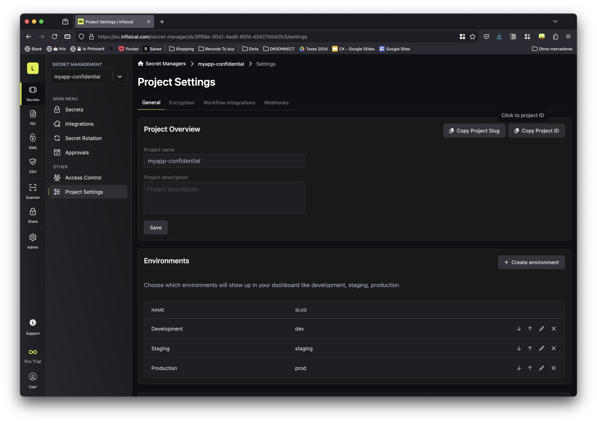
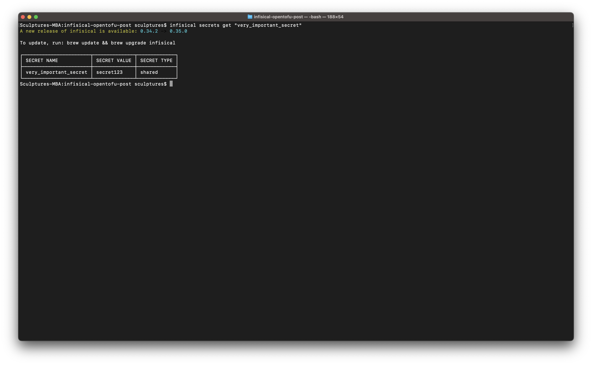

## On this page

- Introduction.
- Assumptions and pre-requisites.
- Configure Infisical on your dev environment and create an Infisical project.
- Create an Infisical Machine Identity and expose it to OpenTofu.
- Store a secret within Infisical.
- Retrieve a secret from Infisical, inject it into an OpenTofu startup script.
- Deploy a GCP compute instance with OpenTofu.
- Conclusions.

## Introduction

A seasoned infrastructure engineer understands the critical importance of security, particularly when it comes to protecting sensitive data. Safeguarding this data from theft or unauthorized access is one of the engineer's top priorities. With the wide range of tools available today, implementing robust security practices has never been easier.

In this post, we’ll explore how to use Infisical, an open-source secrets management platform. Teams rely on Infisical to centralize their configuration and manage sensitive secrets securely. Additionally, we’ll walk through the process of integrating Infisical with OpenTofu, a fully open-source fork of Terraform.

Imagine you store your secrets in Infisical, and you need to expose one secret to a GCP compute instance startup script. The script will likely use the secret in a variable later to perform another task. We will show how to integrate Infisical and OpenTofu to retrieve the secret and safely inject it in the startup script.

More in detail, we will go through this steps:
- Set up Infisical on your dev environment and create a new Infisical project.
- Create an Infisical Machine Identity and expose it to OpenTofu.
- Store a secret within Infisical.
- Retrieve a secret from Infisical, inject it into the instance startup script.
- Deploy a GCP compute instance with OpenTofu.

I hope everything is clear so far. Let’s move forward.

## Assumptions and pre-requisites

To keep this post concise, we’ll assume the following prerequisites are already in place:

- The necessary tools are installed: `git`, `tofu`, `infisical`, and `gcloud`.
- Your GCP account is configured, with the following APIs enabled: Compute, Billing, and Identity and Access Management.
- You have an Infisical account for your organization. Infisical offers a paid cloud version with a generous free tier, which we will be using in this guide. For simplicity, we won’t cover the configuration of the self-hosted, open-source version.
- Make a note of the region and organization used when registering for your Infisical account, as you’ll need them later. In this post, the organization name is `Liminal`, and the region is EU (Europe).

Once the prerequisites are in place, we can move on to the next section.

## Configure Infisical on your dev environment and create your Infisical project.

Once you have [registered an Infisical account](https://app.infisical.com/signup), you have to configure its CLI. Keep in mind the Infisical region selected in the previous step.

Begin by authenticating within the Infisical platform. Choose the region selected on account creation:

```bash
infisical login
```


Open the URL offered in the previous step. Complete authentication via web browser. 


Log in, pick region and organisation. Then you'll see:


Head back to the terminal. You have sucesfully authenticated the CLI.


We will create a new project. A [project in Infisical](https://infisical.com/docs/documentation/platform/project) is a collection of secrets distributed within environments and organised by folders. Since Infisical doesn’t provide a command-line option, we’ll rely on its web interface.  Open your browser to [https://app.infisical.com](https://app.infisical.com). Log in and click on "Add New Project".


We will use this project to store secrets and configuration for an example application. Use the Project Name `myapp-confidential`. Add an optional description. Click on "Create Project".


Our project has been sucessfuly created.


We are going to configure Infisical in our infra repo. We will use an example OpenTofu repository specifically created for this post. In the terminal run:

```bash
git clone git@github.com:therobot/infisical-opentofu-post.git
```

Run `infisical init` to initialize the project. Select the organization you created in the previous step, in this case is `Liminal`.

```bash
cd infisical-opentofu-post
infisical init
```


Then select the project created in the previous step: `myapp-confidential`.


After the command completion a new configuration file `.infisical.json` will be created in your root directory. 

Once you completed this section you should have: an Infisical project named `myapp-confidential`, the infisical CLI configured, and our example infra repo [infisical-opentofu-post](https://github.com/therobot/infisical-opentofu-post) checked out. 

## Create a Machine Identity and expose it to OpenTofu

An Infisical Machine Identity is an entity that symbolizes a workload or application needing access to different resources within Infisical. Think of it as an IAM user in AWS or a service account in GCP. We are going to create one and expose it as an environment variable.

In the Infisical web admin interface, in the Sidebar got to: Admin > Access Control. Find and click "Identities" and then "Create Identity".


Now click on "Create a new Identity". Afterwards type `opentofu` for the identity name, assign the role Member. 


Let's assign the Machine Identity to our project. In this same screen click on the "+" symbol located at the end-right of the interface.


 Select `myapp-confidential` and apply the role Developer, click Add.


Voila! We have our identity created. We will use Universal Auth method for our client, but we need to take note of a couple of parameters for authenticating our OpenTofu client. Click on the settings wheel next to Universal Auth, under Authentication. 


Take note of Client ID. Then click on "Add Client Secret" and then click create. Note down Client Secret since it only will be shown once. Close the window. 


This screenshot shows our Client Secret sucesfully created:


Finally we will need the workspace ID parameter to complete our OpenTofu configuration. Click on "Secrets" on the sidebar > `myapp-confidential > "Project Settings". Then click on "Copy Project ID" and note it down.



We will expose the three parameters as shell environment variables, replace the parameters in angle brackets below with the ones noted down:

```bash
export TF_VAR_INFISICAL_CLIENT_ID="<OPENTOFU_CLIENT_ID>"
export TF_VAR_INFISICAL_CLIENT_SECRET="<OPENTOFU_CLIENT_SECRET>"
export TF_VAR_INFISICAL_WORKSPACE_ID="<MYAPP_CONFIDENTIAL_PROJECT_ID>"
```

We have created a Machine Identity and exposed as environment variables, which we will use later in Open Tofu. Let's step forward.

## Store a secret in Infisical
 
We are ready to store secrets in the Infisical project. Store a secret named `very_important_secret` with an example value of `secret123` in our `dev` environment. [Infisical supports multiple environments per project](https://infisical.com/docs/documentation/platform/project#project-environment). 

On the command line execute:

```bash
infisical secrets set "very_important_secret=secret123" --env dev
```


Now you can review your secret:
```bash
infisical secrets get "very_important_secret"
```



Infisical supports CRUD operations in the secrets, for more information check [the official docs](https://infisical.com/docs/cli/commands/secrets#description).

We are done creating our secrets, let's retrieve a secret in OpenTofu.

## Retrieve a secret from Infisical, inject it into an OpenTofu startup script.

Now that we have our secret safely stored in Infisical. Let's go back to our OpenTofu infra repo. Check out the files in the root folder:

```bash
ls -l
total 64
-rw-r--r--@ 1 sculptures  staff  1117 Feb 27 12:49 init-script.sh.tpl
-rw-r--r--@ 1 sculptures  staff  1770 Feb 25 23:26 main.tf
-rw-r--r--@ 1 sculptures  staff  1007 Feb 25 23:32 outputs.tf
-rw-r--r--@ 1 sculptures  staff   152 Feb 25 23:20 terraform.tfstate
-rw-r--r--@ 1 sculptures  staff  8426 Feb 25 23:20 terraform.tfstate.backup
-rw-r--r--@ 1 sculptures  staff   898 Feb 22 18:42 providers.tf
-rw-r--r--@ 1 sculptures  staff   898 Feb 22 18:42 variables.tf
```

Open [main.tf](https://github.com/therobot/infisical-opentofu-post/blob/main/main.tf) in your editor – this file contains the most essential infrastructure code. Check out the Infisical syntax provider:

```tf
provider "infisical" {
  host          = "https://eu.infisical.com" # Specify the region you have selected when you created the workspace
  client_id = var.infisical_client_id
  client_secret = var.infisical_client_secret
}

```

Both variables `client_id` and `client_secret` are already available in our environment. Those variables should be also declared in [variables.tf](https://github.com/therobot/infisical-opentofu-post/blob/main/variables.tf). It is important to configure the `host` URL to the specific region you are using. There's a bug in Infisical that makes OpenTofu crash if you specify `app.infisical.com`, as the official documentation states.

The next block retrieves the whole infisical project `myapp-confidential` and instances it as an OpenTofu data object. We are also consuming `workspace_id` from our shell environment, same as with the provider:

```tf
data "infisical_secrets" "myapp-confidential" {
  env_slug     = "dev"
  workspace_id = var.infisical_workspace_id
  folder_path  = "/"
}
```

The following code declares a template which will later be used for the startup script in the compute instance creation:

```tf
data "template_file" "myapp_init_script" {
  template = file("init-script.sh.tpl")
  vars = {
    very_important_secret = data.infisical_secrets.myapp-confidential.secrets.very_important_secret.value
  }
}
```

Take a moment to consider how to access a specific secret within the Infisical data object. We accessed `very_important_secret` from the `infisical_projects` data object, which is then instantiated as a template variable: 

Now pay special attention to the last line of our template: [init-script.sh.tpl](https://github.com/therobot/infisical-opentofu-post/blob/main/init-script.sh.tpl). Here `very_important_secret`, now a variable, is rendered by the OpenTofu template data source.

```bash
# init-script.sh.tpl
export MYAPPSECRET=${very_important_secret}
```

Examine the code that declares the compute instance resource. The resource renders the specified by `metadata_startup_script`, the template declaration already has `very_important_secret` since we have passed it as a variable in the previous step. The startup script is executed as part of the compute instance creation process.


```tf
resource "google_compute_instance" "web" {
  name         = "web-${random_pet.name.id}"
  machine_type = "n2-standard-4"
  zone         = "europe-west8-a"
  metadata_startup_script = data.template_file.myapp_init_script.rendered
...
```

We are done here, now let's create some infrastructure!

## Deploy a GCP compute instance with OpenTofu.

Finally, we have finalised all the required steps to create our infrastructure. We just need to execute the usual steps on OpenTofu to create our infrastructure.

```bash
tofu init
```
Run the OpenTofu `plan` command to create a preview of resources created and destroyed.

```bash
tofu plan
```
A sucessful `plan` command will output a preview of the changes performed to your infrastructure. Now it is time to make this changes real.

```bash
tofu apply
```

Upon successful execution, the command will create the instance and run the script that instantiates `very_important_secret`. As we saw above the secret is exposed as a environment variable for later use in the script.

A good way to verify all the steps in the example is to echo the variable to a file in the script, the manually log in to the compute instance to see if it has been rendered correctly. You can also inspect the secret from the command line, as we have a specific output resource for the secret defined in [outputs.tf](https://github.com/therobot/infisical-opentofu-post/blob/main/outputs.tf).

```bash
tofu output -json very_important_secret
"secret123"
```

## Conclusion

In this guide, we have walked through the process of managing secrets using Infisical and integrating it with OpenTofu to securely inject secrets into a GCP compute instance startup script. Here are the key steps we covered:

- **Configure Infisical**: Set up Infisical on your development environment, create a new project, and initialize it.
- **Create a Machine Identity**: Create an Infisical Machine Identity and expose it to OpenTofu as environment variables.
- **Store Secrets**: Store a secret in Infisical and retrieve it using the Infisical CLI.
- **Deploy Infrastructure**: Use OpenTofu to deploy a GCP compute instance and inject the secret into the instance's startup script.

By following these steps, you can ensure that your sensitive data is securely managed and injected into your infrastructure, reducing the risk of unauthorized access. This integration between Infisical and OpenTofu provides a robust solution for managing secrets in a cloud environment.
